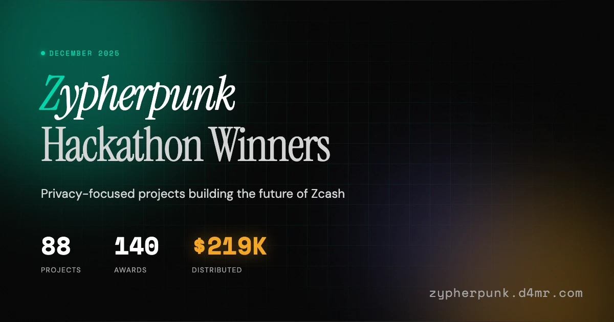

# Zypherpunk Hackathon Winners

[](https://zypherpunk.d4mr.com)

**[zypherpunk.d4mr.com](https://zypherpunk.d4mr.com)**

---

An unofficial community archive of winning projects from the Zypherpunk Hackathon (December 2025). Browse 88 privacy-focused projects building the future of Zcash.

> **Disclaimer:** Not affiliated with [zypherpunk.xyz](https://zypherpunk.xyz), the hackathon organisers, or any sponsors. Data compiled from winner announcements in the official Discord server.

## Features

- **Search & Filter** - Find projects by name, builder, sponsor, or track
- **Sort** - By prize amount, award count, or name  
- **Project Details** - Full descriptions, links, team info, and awards
- **Static & Fast** - Pre-rendered at build time, data fetched from Devfolio

## Tech Stack

| | |
|---|---|
| Framework | [Astro 5](https://astro.build) |
| UI | [React 19](https://react.dev) + [Tailwind CSS 4](https://tailwindcss.com) |
| Animations | [Motion](https://motion.dev) |
| Search | [Fuse.js](https://fusejs.io) |
| Hosting | [Cloudflare Pages](https://pages.cloudflare.com) |

## Development

```bash
bun install      # Install dependencies
bun dev          # Start dev server at localhost:4321
bun build        # Build for production
bun preview      # Preview production build
```

## Contributing

Found an error? Want to add a missing project or fix award data?

**PRs welcome:** [github.com/d4mr/zypherpunk-results](https://github.com/d4mr/zypherpunk-results)

The award data lives in `data/projects.json`.

## License

MIT

---

Made by [d4mr](https://d4mr.com)
